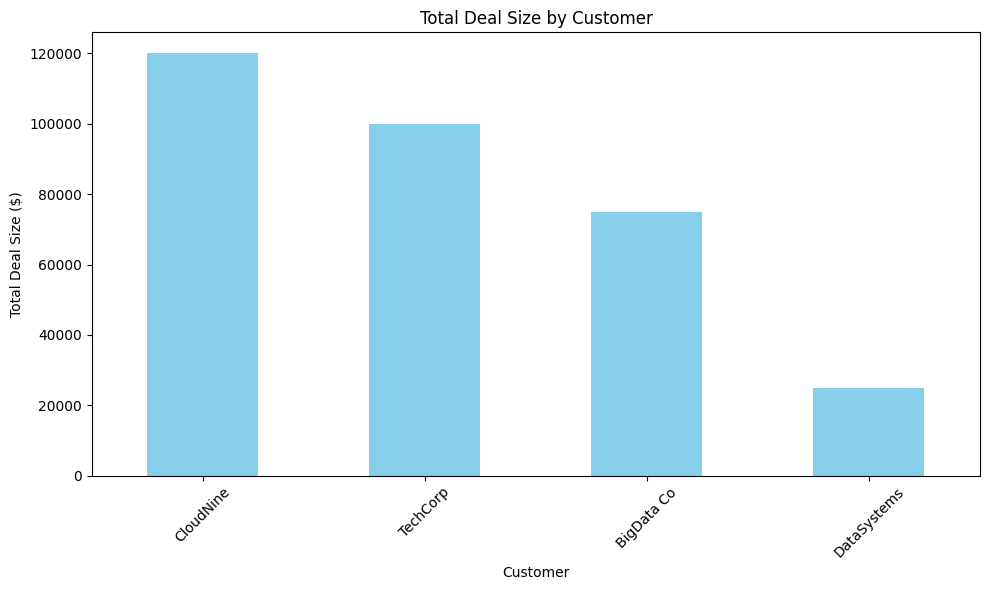

# 📈 Sales Data & Revenue Analyzer

## 🎯 The Goal
As an Account Manager, I deal with messy client data every day. I built this script to automate the "boring stuff"—cleaning duplicate entries and calculating total revenue from closed deals—so I can focus on strategy.

## 🛠 Tech Used
* **Python 3**
* **Pandas Library:** Used for data manipulation and cleaning.
* **Matplotlib.pylot Library:** Used for lotting bar chart and heatmap

## 🚀 How it Works
1. **Data Ingestion:** Simulates a raw export from a CRM.
2. **Deduplication:** Automatically identifies and removes duplicate customer entries.
3. **Logic:** Filters the data to sum up 'Closed' deals while ignoring 'Pending' ones.
4. **Reporting:** Prints a clean summary to the console.

## 🧠 What I Learned
* How to handle `DataFrames` (the foundation of AI data).
* The importance of data cleaning before analysis.
* How to use f-strings for professional reporting.

---
*This is my first step into bridging the gap between Sales and Data Science!*
